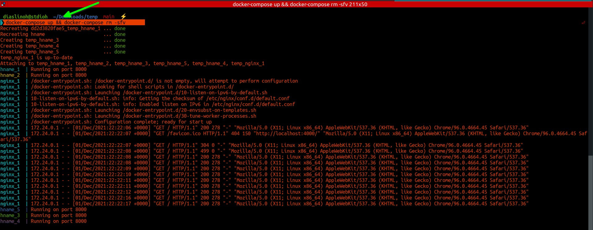
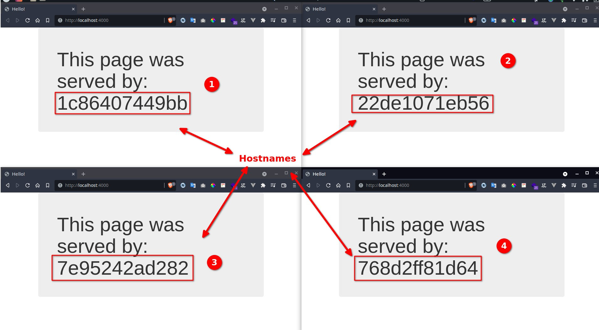

# test-nginx-load-balancer
Testing a load balancer with nginx and docker

# Requirements 📄📄📄
1. [docker](https://www.docker.com/get-started)
2. [docker-compose](https://docs.docker.com/compose/install/)

# Setup ⚙️⚙️⚙️

```sh
git clone https://github.com/stdioh321/test-nginx-load-balancer.git
cd test-nginx-load-balancer
```

# Run 🏃‍♂️🏃‍♂️🏃‍♂️
```sh
docker-compose up && docker-compose rm -sfv
```

Open your favorite browser at:

**http://localhost:4000**

And hit "**Refresh**" a couple of times, the message should change.
|docker-compose|Browser|
|:--|:--|
||


# References
* https://pspdfkit.com/blog/2018/how-to-use-docker-compose-to-run-multiple-instances-of-a-service-in-development/#adding-a-load-balancer
* https://hub.docker.com/r/oguzpastirmaci/hostname